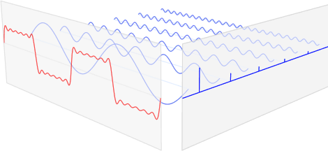

# Heartbeat  

## Here's a question: How hard would it be to tell a normal heartbeat from an abnormal one from just sound?
In other words, can we analyze audio recordings of heartbeats, with all their variation as well as environmental noise and still be able to distinguish between normal heartbeat from one where you should call an ambulance? 

And, from there, can we develop a tool that allows people in less well served locations to maximize their chance of survival by getting them to healthcare sooner.

## So, Why Am I Interested In This?

* I'm a former paramedic and I've been on calls where people would have benefitted from something like this, both in terms improving mortality and morbidity.

* I like hard problems that are worthwhile and I know that medicine has been trying to crack this problem for about 50 years now.

* This seemed like and this seemed like something that hadn't been done before.

On that last point, well ... yes and no ... but mostly no.

## The Data - And It's Backstory 
Physicians have been listen to heart sounds for about 200 years. Auscultation as it's known is somewhat difficult there are whole courses on it and even experts get it wrong. But it's still a good first step because it's fast, inexpensive and a trained ear can get a lot of more obvious patterns.

One of the underpinnings of the not being able to classify heart rhythms by sound is that up until somewhat recently, there was no good set of audio recordings. In 1999 the NIH funded MIT's Laboratory for Computational Physiology to establish and run [physionet](https://physionet.org/) as repository of recordings, models and research -- all open and freely available. Physionet also sponsors yearly challenges which are alway computational in nature but usually related to the heart; the dataset I used was from the [2016 Physionet heartsounds challenge](https://physionet.org/content/challenge-2016/1.0.0/).

Physionet did an excellent job with structuring the recordings. They kept a separate holdout set for validation that was released only after the competition was concluded. The data researchers were give was pre-randomized, and split into five subsets, each with a separate files listing which recordings were normal and abnormal. More information on the datas as well as the results of the top models can be found at the [challenge website](https://physionet.org/content/challenge-2016/1.0.0/).

The recordings were sourced from contributors around the world and were collected both clinical or nonclinical environments.  The Challenge training set consists of five databases (A through E) containing a total of 3,126 heart sound recordings, lasting from 5 seconds to just over 120 seconds. Of the recordings, about 1/2 are normal and were from healthy subjects and the abnormal ones were from patients with a confirmed cardiac diagnosis but not further information was included.

The heart sound recordings were collected from different locations on the body that include the typical four locations above but could be one of nine different locations.

## EDA -- Plus A Bit On How The Heart Works

Four locations are most often used to listen to the heart sounds, which are named according to the positions where the valves can be best heard:

* Aortic area - centered at the second right intercostal space.
* Pulmonic area - in the second intercostal space along the left sternal border.
* Tricuspid area - in the fourth intercostal space along the left sternal edge.
* Mitral area - at the cardiac apex, in the fifth intercostal space on the mid-clavicular line.

Incidentally, sounds were taken from one or more the four above locations in addition to another five unidentified locations.

Incidentally, sounds were taken from one or more the four above locations in addition to another five unidentified locations.

From that we get sounds that, visualized, ideally looks something like this:

Or, if you used a pulseOx meter, you could create a [photoplethysmogram](https://en.wikipedia.org/wiki/Photoplethysmogram) that looks pretty similar.

But when you add in noises, like conversations, breathing, the moving of a stethoscope, bowel noises, etc, you get something that looks like this:

But stretched out looks more familiar

### What are the units?

X-axis are easy. The length of the segment divided by the sample rate = seconds.
Y-axis is amplitude.

... Meaning my EDA was largely signals analysis

# Where All The Freqs At?

You many remember from high school how a wave can me made of other simpler waves.

But they never said how actually find them. That's because you need partial differential equations in the form of Fourier transformation __O(n2)__ or a Fast Fourier Transformation __O(n log n)__ ... or scipy.

Which in this case looks liked this:

#### Yo, that sh*t's nuts! The heartbeat from two images up is what would be in red from one image up. This here, in blue is the same as the five blue marks on the side there. It can't have that many signals,can it?

#### Oh yes, yes it can. Even if you take out 2/3's of them.

## How I Learned to Stop Worrying and Love -- Or At Least Accept FFT by building a toy model

Heartbeat frequency cut-off           |  Visualizing Heartbeat Data
:-------------------------:|:-------------------------:
  |  

So, yeah, that craziness above _is_ the fft of the signal.

But we know there is more auditory power at the bottom range of spectrum. We know this because when we listen to heartbeat we hear that thump-thump about once a second. So there has to be more energy those frequencies than the rest or we couldn't pull the heartbeat (the signal) out from the noise. But how do figure that out.

Turns out a Power Spectrum Density graph (also in scipy) is the solution.

I'd like to say from here is was models and great results. But it wasn't. And maybe you're thinking you might like to take a shot at it.

### Don't expect Google to be of much help. It was overrun by wingnuts

Heartbeat frequency cut-off           |  Visualizing Heartbeat Data
:-------------------------:|:-------------------------:
  |  

## Prior Work
As I mentioned, people have been trying to solve this for the last 50 or so years. Some of the prior work includes:

* Artificial neural networks (ANNs) have been the most widely used machine learning-based approach for heart sound classification. Most of these have focused on identification based on wavelet features, time, frequency and complexity-based features or time-frequency features. 

* A number of researchers have also applied support vector machines (SVM) for heart sound classification in recent years. Those studies have focused on wavelet, time, frequency and time-frequency feature-based classifiers. 

* Hidden Markov models (HMM)for pathology classification in PCG recordings.

* Clustering-based classifiers, typically the k-nearest neighbors (kNN) algorithm, have also been employed to classify pathology in PGCs. In addition, many other techniques have been applied, including threshold-based methods, decision trees, discriminant function analysis and logistic regression.

## Resources
[Paul Vangent](http://www.paulvangent.com) -- has an interesting material. He uses a much less noisy PPG but his stuff is well written and interesting.

[Ahmet Taspinar](http://ataspinar.com/2018/04/04/machine-learning-with-signal-processing-techniques/) -- Has an interested GitHub repo on signal processing with ML. I wasn't able to get it to work but it looks promising. 